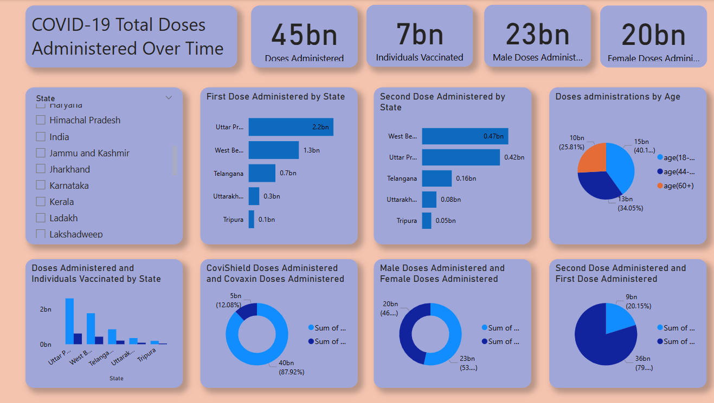

# 🦠 COVID-19 Vaccination Analysis Dashboard (Power BI)

## 📌 Project Overview

This Power BI dashboard analyzes COVID-19 vaccination data to understand vaccination trends, dose distribution, and demographic patterns across different states.

The dashboard highlights vaccination progress, gender distribution, and age group coverage.

## 🎯 Objectives

* Analyze total vaccination doses administered over time
* Compare first dose and second dose distribution by state
* Study vaccination coverage across different age groups
* Understand gender-based vaccination distribution

## 📊 Key Metrics

* Total Doses Administered: 45 Billion
* Individuals Vaccinated: 7 Billion
* Male Doses Administered: 23 Billion
* Female Doses Administered: 20 Billion

## 📈 Key Insights

* Certain states such as Uttar Pradesh and West Bengal administered the highest number of first doses.
* The majority of vaccinations were administered through Covishield compared to Covaxin.
* The 18–44 age group received the largest share of vaccinations.
* First dose administration significantly exceeded second dose distribution during early vaccination phases.

## 📊 Visualizations Used

* KPI Cards
* Bar Charts
* Pie Charts
* Donut Charts
* State Filters

## 🛠 Tools Used

* Power BI
* Data Visualization
* Data Analysis

## 📷 Dashboard Preview

## 📂 Dataset

COVID-19 vaccination dataset including:

* State-wise vaccination counts
* Age group distribution
* Gender-based dose administration
* Vaccine type distribution
